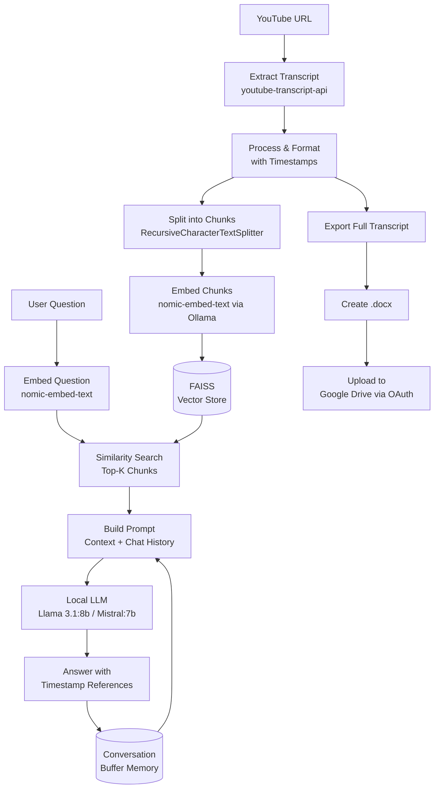

# 🎬 YouTube Transcript Chatbot

> Transcribes, summarises and answers questions about any YouTube video.

---

## What is this?

A locally running chatbot that extracts transcripts from any YouTube video and lets you summarize the content and ask questions about it. The chatbot remembers the user's previous questions within a session, references timestamps in its answers, and can export the full transcript as a `.docx` file directly to the user's Google Drive.

---

## Architecture



---

## Tech Stack

| Component | Tool |
|---|---|
| LLM runtime | Ollama |
| LLM models | Llama 3.1:8b / Mistral:7b |
| Embeddings | nomic-embed-text via Ollama |
| Vector store | FAISS |
| Orchestration | LangChain |
| Memory | ConversationBufferMemory |
| Transcript extraction | youtube-transcript-api |
| UI | Gradio |
| Export | python-docx + Google Drive API |
| Auth | OAuth 2.0 |

---

## Folder Structure

```
utube-transcript-chatbot/
├── app.py                  # Gradio UI — all interface logic
├── chatbot.py              # Core logic — transcript, RAG chain, memory
├── drive.py                # Google Drive integration — auth + upload
├── config.py               # All constants and model settings
├── requirements.txt        # Project dependencies
├── .gitignore
└── credentials/            # Excluded from Git
    ├── oauth_credentials.json
    └── token.json          # Auto-generated after first OAuth login
```

---

## Setup & Installation

### Prerequisites
- Python 3.11
- [Ollama](https://ollama.com) installed and running
- Google Cloud project with Drive API enabled and OAuth 2.0 credentials

### 1. Clone the repo
```bash
git clone https://github.com/ivsheran/utube-transcript-chatbot.git
cd utube-transcript-chatbot
```

### 2. Create and activate virtual environment
```bash
/opt/homebrew/bin/python3.11 -m venv venv
source venv/bin/activate
```

### 3. Install dependencies
```bash
pip install -r requirements.txt
```

### 4. Pull Ollama models
```bash
ollama pull llama3.1:8b
ollama pull mistral:7b
ollama pull nomic-embed-text
```

### 5. Add Google Drive credentials
- Create a `credentials/` folder in the project root
- Add your `oauth_credentials.json` from Google Cloud Console
- On first run, a browser window will open for one-time OAuth authentication

### 6. Configure `config.py`
```python
DRIVE_FOLDER_ID = "your-google-drive-folder-id"
```

### 7. Run the app
```bash
python app.py
```

Open `http://localhost:7860` in your browser.

---

## How to Use

1. Paste a YouTube URL into the **Insert your YouTube link** field
2. Select a model — `llama3.1:8b` (default) or `mistral:7b`
3. Click **Load Video** and wait for the ✅ status
4. Ask Ash anything about the video in the chat
5. Click **Save Transcript to Drive** to export the full transcript as `.docx`
6. Use **Clear Chat** to reset the conversation while keeping the video loaded
7. Use **New Video** to start fresh with a different video

---

## Key Technical Decisions

**Why local LLMs via Ollama?**
Full privacy and zero API cost per query, which matters for a tool used frequently.

**Why FAISS over a hosted vector DB?**
The search scope is limited by one video transcript - no need for big storage. For Q&A Chatbot matters speed. FAISS is an ultra-fast vector similarity search engine that fits this use case the best.

**Why buffer memory with a 5-turn limit?**
Llama 3.1:8b has an 8k context window. Passing the full conversation history grows the prompt rapidly and degrades answer quality. A 5-turn window keeps the context manageable while still supporting natural follow-up questions.

**Why nomic-embed-text for embeddings?**
It outperforms general-purpose sentence transformers on retrieval benchmarks and runs entirely through Ollama — no separate Python model download or HuggingFace dependency.

**Why OAuth over a service account for Google Drive?**
Service accounts have no Drive storage quota and cannot write to a personal Drive folder. OAuth authenticates as the actual user, giving direct access to their Drive with a one-time browser login.

---

## Part of

This project is part of a PM technical portfolio demonstrating hands-on capability across AI tooling and modern development practices, including: RAG pipeline design, local LLM integration, vector similarity search, video-to-text extraction, and Google API integration with OAuth 2.0 authentication and Google Drive file management.